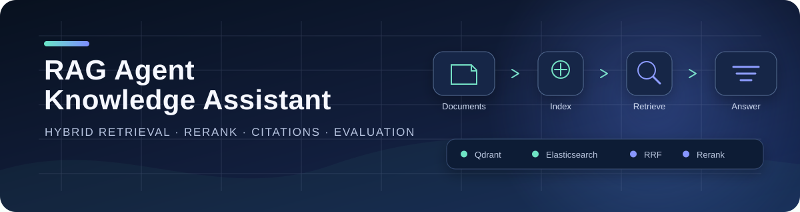
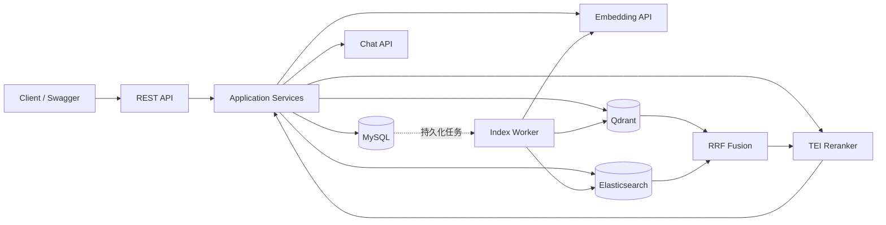

<p align="center">
  
</p>

<p align="center">
  <strong>面向真实工程链路的 RAG 知识库问答后端</strong>
  <br />
  从文档入库、双路召回、RRF 融合与重排，到引用追踪、索引一致性和离线评测。
</p>

<p align="center">
  <a href="https://github.com/Jiyun-he/rag_agent_knowledge_assistant/actions/workflows/ci.yml"></a>
  
  
  
  <a href="LICENSE"></a>
</p>

<p align="center">
  <a href="#项目亮点">项目亮点</a> ·
  <a href="#系统架构">系统架构</a> ·
  <a href="#快速开始">快速开始</a> ·
  <a href="#测试策略">测试策略</a> ·
  <a href="#文档导航">项目文档</a>
</p>

---

## 项目定位

RAG Agent Knowledge Assistant 是一个基于 Spring Boot 的知识库问答后端。它不仅实现“向量检索 + 大模型回答”，还覆盖了 RAG 系统更容易被忽略的工程问题：多路检索融合、异步索引任务、失败重试、索引对账、回答引用，以及可复现的检索质量评测。

这个仓库适合作为：

- 企业内部知识库、技术文档助手或项目资料检索服务的后端原型；
- Hybrid Search、Rerank 和文本切分策略的实验平台；
- Spring AI、Qdrant 与 Elasticsearch 协同落地的参考实现。

> 当前项目以学习、实验与作品展示为主要目标，尚未包含用户鉴权、租户隔离和生产级可观测性。

## 项目亮点

| 能力 | 实现 |
| --- | --- |
| 完整 RAG 链路 | 文档入库 → 文本切分 → Embedding → 检索 → Rerank → 回答生成 → 引用落库 |
| 四种检索模式 | `VECTOR_ONLY`、`KEYWORD_ONLY`、`HYBRID`、`HYBRID_RERANK` |
| 可靠索引任务 | 事务提交后登记任务、指数退避重试、超时回收、人工重试与周期对账 |
| 可追踪回答 | 返回命中的 chunk、各阶段分数与回答引用，便于解释和排查 |
| 可量化评测 | Recall@K、Hit@K、MRR、关键词命中率、引用精确率/召回率与延迟 |
| 两种切分策略 | 定长字符切分，以及基于 Markdown AST 的结构感知切分 |

### 实验结果一览

在 MyBatis 3.5.19 中文文档、26 个评测问题、`topK=5` 的实验中：

| 方案 | Recall@5 | Hit@5 | MRR@5 |
| --- | ---: | ---: | ---: |
| 定长切分 + Hybrid Rerank | **0.9647** | **1.0000** | 0.9051 |
| 结构感知切分 + Hybrid Rerank | 0.9503 | **1.0000** | **0.9658** |

这组实验主要验证检索质量，不包含回答生成；完整条件、延迟数据和局限见 [评测结果](evaluation/mybatis-eval/RESULTS.md)。

## 系统架构



### 核心链路

```text
文档写入
  └─> 文本切分 ─> MySQL 保存 chunk ─> 提交后登记 BUILD_INDEX 任务
                                                └─> Embedding ─> Qdrant
                                                └─> Keyword Index ─> Elasticsearch

用户提问
  └─> 向量召回 + 关键词召回 ─> RRF 融合 ─> 可选 Rerank ─> 生成回答与引用
```

架构边界、状态流转和设计取舍详见 [系统架构文档](docs/architecture.md)。

## 技术栈

| 层次 | 技术 |
| --- | --- |
| 应用框架 | Spring Boot 3.5、Spring AI 1.1 |
| 数据访问 | MyBatis-Plus、MySQL 8.4 |
| 检索能力 | Qdrant、Elasticsearch + smartcn、RRF |
| 模型服务 | OpenAI-compatible Chat / Embedding API、TEI Rerank |
| 文本处理 | commonmark-java、jtokkit |
| 工程能力 | Maven、Docker Compose、SpringDoc OpenAPI、JUnit 5 |

## 快速开始

### 1. 环境要求

- JDK 17+
- Docker 与 Docker Compose
- 一个 OpenAI-compatible API Key

### 2. 准备配置

```bash
git clone https://github.com/Jiyun-he/rag_agent_knowledge_assistant.git
cd rag_agent_knowledge_assistant
cp .env.example .env
```

Windows PowerShell 可使用：

```powershell
Copy-Item .env.example .env
```

随后在 `.env` 中填写 `OPENAI_API_KEY`；模型名和 Base URL 可按需覆盖。

### 3. 启动依赖

```bash
docker compose up -d
```

Compose 会启动 MySQL、Qdrant、Elasticsearch 和 TEI Rerank。`redis` 与 `rabbitmq` 是后续规划的预留服务，当前业务链路不依赖它们。Rerank 模型首次下载耗时较长，详情见 [配置说明](docs/configuration.md#依赖服务)。

### 4. 启动应用

```bash
./mvnw spring-boot:run
```

| 入口 | 地址 |
| --- | --- |
| API 服务 | `http://localhost:8080` |
| Swagger UI | `http://localhost:8080/swagger-ui.html` |
| OpenAPI JSON | `http://localhost:8080/v3/api-docs` |

## 检索模式

| 模式 | 处理流程 | 适用场景 |
| --- | --- | --- |
| `VECTOR_ONLY` | Qdrant 语义召回 | 自然语言改写、同义表达 |
| `KEYWORD_ONLY` | Elasticsearch 关键词召回 | 类名、配置项、接口路径等精确词 |
| `HYBRID` | 双路召回 + RRF 融合 | 兼顾语义与关键词的通用检索 |
| `HYBRID_RERANK` | Hybrid + Cross-Encoder 重排 | 更重视排序质量、可接受额外延迟 |

各阶段分数和 `candidateK` 语义见 [检索设计](docs/retrieval.md)。

## 测试策略

默认测试只运行不依赖外部基础设施的单元测试：

```bash
python scripts/quality/check_style.py
./mvnw test
```

端到端测试需要先启动 Docker Compose，再显式启用集成测试：

```bash
docker compose up -d
./mvnw verify -Pintegration-tests
```

| 类型 | 默认执行 | 位置 | 依赖 |
| --- | :---: | --- | --- |
| 单元测试 | ✓ | `src/test/java/.../util`、`.../service/impl` | 无外部服务 |
| 端到端测试 | — | `src/test/java/.../e2e` | MySQL、Qdrant、Elasticsearch、TEI |
| 探索性实验 | — | `src/test/java/.../explore` | 本地数据集 |
| HTTP 脚本 | 手动 | `src/test/http` | 已启动的应用 |

## 仓库结构

```text
.
├─ .github/workflows/      # 持续集成
├─ src/main/java/          # Controller / Service / Mapper / Domain
├─ src/main/resources/     # 应用配置与数据库 schema
├─ src/test/               # 单元、端到端与 HTTP 测试
├─ docs/                   # 架构、API、配置、数据模型与检索说明
├─ dataset/                # 可复现的数据集配置与质量报告
├─ evaluation/             # 评测语料、请求脚本、标注与实验结果
├─ scripts/                # 文档抓取、预处理与数据集构建工具
├─ docker/                 # 自定义 Elasticsearch 镜像
└─ docker-compose.yml      # 本地依赖编排
```

Java 代码保持标准分层包结构；数据准备、离线评测与运行时应用彼此隔离，避免把实验脚本混入核心业务路径。

## 文档导航

| 文档 | 内容 |
| --- | --- |
| [系统架构](docs/architecture.md) | 分层结构、核心流程与设计取舍 |
| [数据模型](docs/data-model.md) | 核心数据表、文档状态机和任务可靠性 |
| [API 文档](docs/api.md) | 接口清单与请求示例 |
| [配置说明](docs/configuration.md) | 依赖服务、环境变量和全部配置项 |
| [检索设计](docs/retrieval.md) | 四种模式、RRF、Rerank 与分数字段 |
| [评测设计](docs/evaluation.md) | 指标定义、评测流程与结果摘要 |
| [完整实验结果](evaluation/mybatis-eval/RESULTS.md) | MyBatis 语料上的对照实验与分析 |
| [数据集说明](dataset/README.md) | 数据来源、构建方式与质量报告 |
| [数据工具](scripts/README.md) | Python 数据处理脚本的使用方式 |
| [HTTP 测试脚本](src/test/http/README.md) | 手工接口验证脚本与执行说明 |

## Roadmap

- [ ] 文件上传与多格式文档解析
- [ ] LLM-as-a-Judge 回答质量评估
- [ ] Prompt 版本管理与实验对比
- [ ] 缓存、消息队列与可观测性
- [ ] 用户鉴权与知识空间权限控制
- [ ] 前端管理与问答页面

## 参与开发

提交代码前请阅读 [CONTRIBUTING.md](CONTRIBUTING.md)。本项目采用清晰、可回滚的小提交，并要求业务变更同步补充测试与文档。

## License

项目代码基于 [Apache License 2.0](LICENSE) 发布。`dataset/` 下第三方文档内容的版权和许可条款以各数据集 README 为准。
